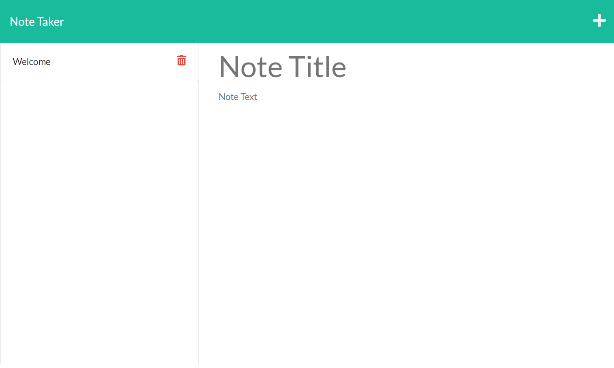

  # Note Taker

  
  ## Description:


  # Table of Contents

  - [Installation](#installation)
  - [Usage](#usage)
  - [Credits](#credits)
  - [License](#license)
  - [Contribution](#contributing)
  - [Deployed](#deployed)
  - [Screenshot](#screenshot)
  - [Contact](#contact)

  
  ## Installation:

  * run ```npm install``` in terminal to install the dependencies. 
  * run ```node server.js``` in terminal
  

  ## Deployed
  https://enigmatic-cove-69206.herokuapp.com/
  
  ## Technologies
  - JavaScript
  - Nodejs


  ## Usage:

  This app will save notes or to-do list for reminders

  ## Credits:

  Made by Bader Munir


  ## License:

  For more information about licenses, please visit:

  [License](https://opensource.org/licenses/MIT)


  ## Contributing:
  
  It is open source

  ## Screenshot:

  

  
  ## Contact:

  - [Github Profile](https://github.com/XBaderM)

  - [Email](bader.munir18@googlemail.com)
  
 

